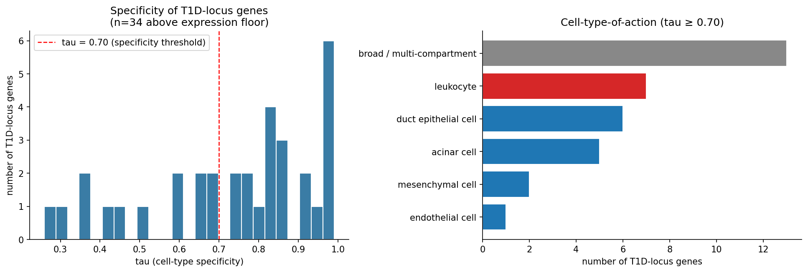
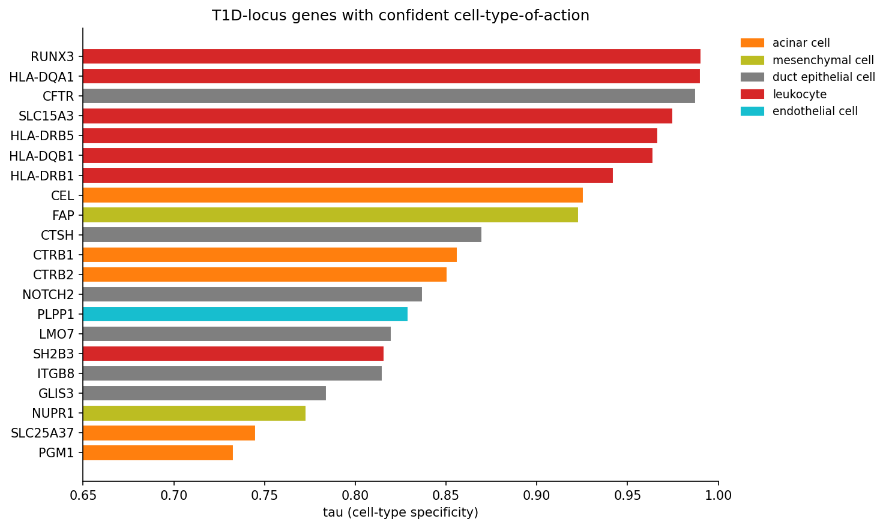
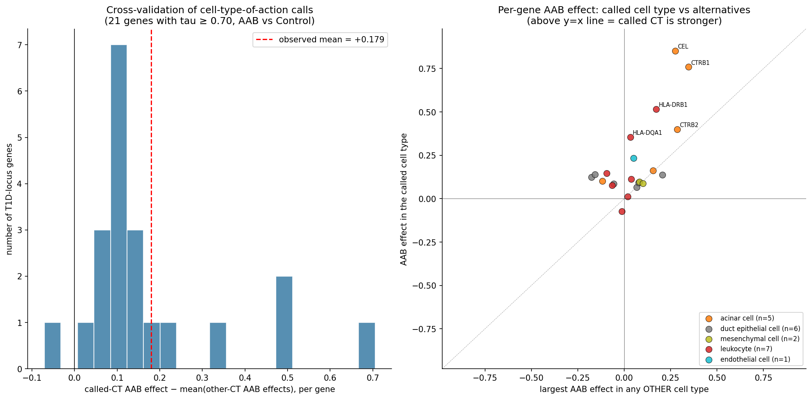

# t1d-celltype-of-action

**Mapping 145 type 1 diabetes GWAS loci to the pancreatic cell types they likely act in.**

Companion article: [*Where do type 1 diabetes risk genes actually live?*](docs/substack_article.md)

---

## TL;DR

- 145 independent T1D risk loci → 188 candidate genes → 150 testable in the HPAP atlas (222,077 cells, 67 donors).
- Used **tau specificity** (Yanai et al. 2005) to assign cell-type-of-action from healthy expression.
- **21 confident calls:** 7 leukocyte (HLA class II, RUNX3, SH2B3), 5 acinar (CEL, CTRB1, CTRB2, PGM1, SLC25A37), 6 duct epithelial, 2 mesenchymal, 1 endothelial. Zero beta cell (tau limitation, not absence of biology).
- **Cross-validation:** AAB-vs-Control effects concentrate in called cell types (mean +0.18 log1p, p < 10⁻⁴, 10,000 permutations).

## Figures

## Structure

| Path | Contents |
|------|----------|
|  | 13 modular pipeline scripts (00–12) |
|  | All processed outputs including  |
|  | All analysis figures |
|  | Companion article markdown |
|  | Full Kaggle analysis notebook |

## Key output

 — tau scores and cell-type calls for all 150 evaluable genes.

## Data

All HPAP data: [PANC-DB](https://hpap.pmacs.upenn.edu). GWAS Catalog release v1.0.3.1 May 2026.

---
*[@crisprking](https://github.com/crisprking)*
